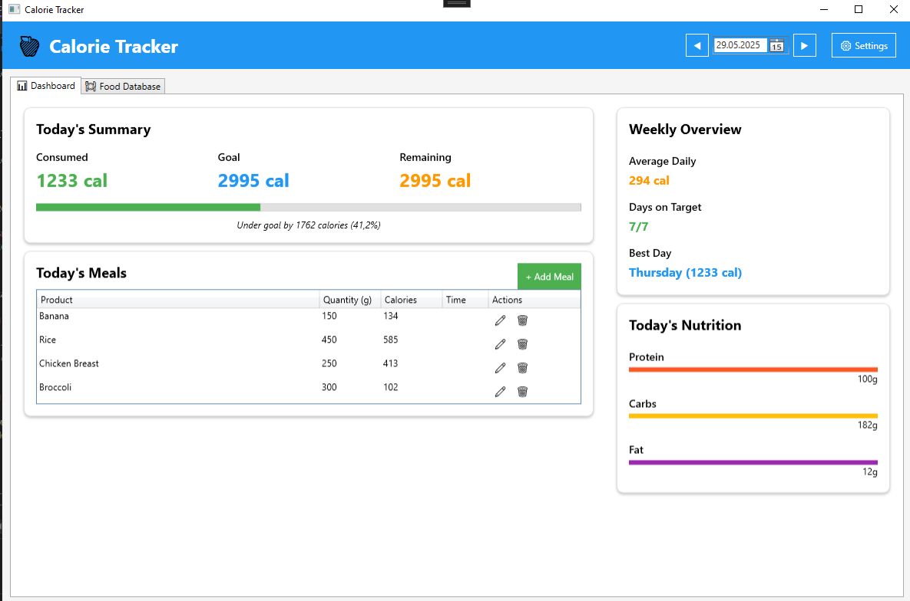
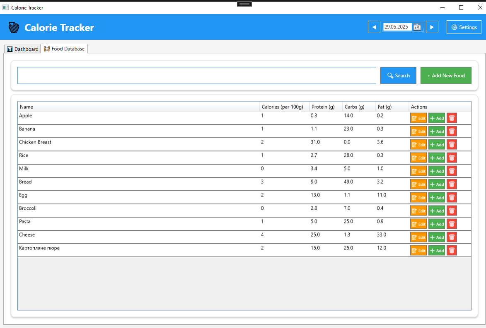

# 🥗 CalorieTracker

**CalorieTracker** — це десктопний WPF-застосунок на C# для відстеження спожитих калорій, створення рецептів, збереження прийомів їжі та контролю особистої добової норми калорій.

---

## 🔧 Локальний запуск

1. Відкрийте `CalorieTracker.sln` у Visual Studio (версія 2019 або новіше).
2. Встановіть залежності (Newtonsoft.Json вже підключено через `packages.config`).
3. Побудуйте проєкт: `Ctrl + Shift + B`.
4. Запустіть застосунок: `F5`.

---

## ⚙️ Функціонал

- Додавання продуктів з інформацією про калорійність.
- Формування рецептів з інгредієнтів.
- Застосування формул Harris-Benedict, Mifflin-St Jeor та Katch-McArdle для розрахунку добової потреби в калоріях.
- Додавання прийомів їжі.
- Налаштування профілю користувача (вага, зріст, вік, активність).
- Повідомлення при перевищенні цільової норми калорій.

# Скріншоти застосунку

---

## 💡 Programming Principles

1. **Single Responsibility Principle (SRP)** — кожен клас має одну чітку відповідальність.
2. **Open/Closed Principle (OCP)** — підтримка нових формул розрахунку без зміни існуючих класів.
3. **Dependency Inversion Principle (DIP)** — логіка залежить від абстракцій (`ICalorieCalculator`, `IRepository`).
4. **Don't Repeat Yourself (DRY)** — спільна логіка винесена у сервіси.
5. **Separation of Concerns (SoC)** — View, ViewModel і Model розділені.

---

## 🧠 Design Patterns

| Патерн | Файл | Призначення |
|--------|------|-------------|
| **Command** | `AddFoodEntryCommand.cs`, `DeleteFoodEntryCommand.cs` | Інкапсуляція операцій у вигляді об'єктів команд. |
| **Factory** | `CalorieCalculatorFactory.cs` | Динамічне створення калькуляторів калорій. |
| **Observer** | `CalorieGoalNotificationService.cs` | Спостерігачі для цільової норми калорій. |

---

## 🛠️ Refactoring Techniques

1. **Extract Class** — виділення класів `HarrisBenedictCalculator`, `MifflinStJeorCalculator`.
2. **Extract Interface** — створення інтерфейсів `ICalorieCalculator`, `IRepository`.
3. **Rename Variable** — підвищення читабельності коду.
4. **Move Method** — перенесення логіки у відповідні сервіси.
5. **Replace Conditional with Polymorphism** — заміна умовної логіки використанням поліморфізму.

---

## 📁 Структура

- `Models/` — моделі даних (продукти, рецепти, профіль).
- `Repositories/` — доступ до даних.
- `Services/` — бізнес-логіка (калькулятори, обчислення).
- `ViewModels/` — логіка відображення для вікон WPF.
- `Views/` — XAML-файли (AddMealWindow, SettingsWindow тощо).

